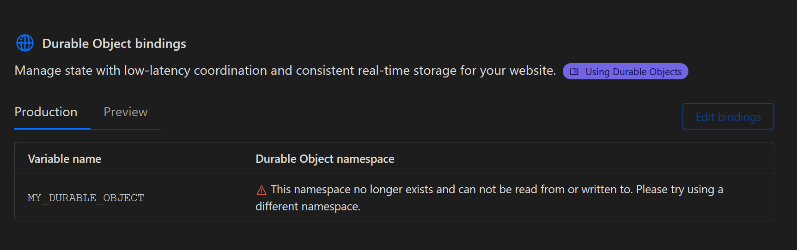

# Cloudflare Durable Objects Pages Binding Error Example

This is an example of a Cloudflare Durable Objects Pages binding error.

## Steps to reproduce

- Deploy the durable object

```
cd durable-object
npm i
npm run deploy
```

- Deploy the pages app

```
cd pages-app
npm i
npm run deploy
```

- Visit the Cloudflare Dashboard for the pages-app
- Go to the "Settings" tab
- Click on "Functions" page
- Scroll down to the "Durable Objects" section and see the following error

(./error.png)